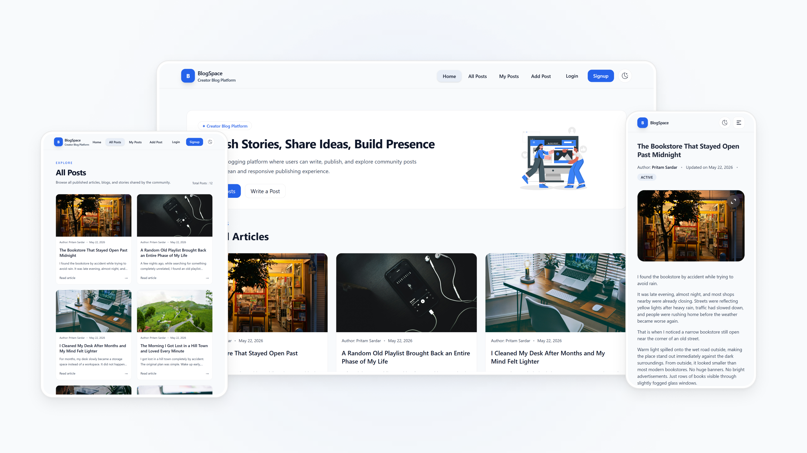

# BlogSpace

A browser based blog platform where users can create, publish, and manage articles. It uses Appwrite for authentication, database, and file storage, with TinyMCE for rich text content creation.

Live: https://blogspace.pritamsardar.dev  |  Case Study: https://pritamsardar.dev/full-case-study/portfolio-creator-blog-platform-v1?source=case-studies

<picture>
  <source media="(prefers-color-scheme: dark)" srcset=".github/images/blogspace-hero-dark.png">
  
</picture>

## Features

* Sign up and log in with email and password
* Write posts using a full featured rich text editor
* Upload a featured image for every post
* Set posts as public or private before publishing
* Edit and delete your own posts from the post page
* Browse all community posts with page by page navigation
* View and manage your own posts from a personal dashboard
* Read related posts at the bottom of every article
* Switch between light and dark mode with no flash on load

## Tech Stack

**Frontend:** React 19, Vite, Tailwind CSS v4

**State Management:** Redux Toolkit

**Backend:** Appwrite (auth, database, file storage)

**Rich Text Editor:** TinyMCE

**Form Handling:** React Hook Form

**Routing:** React Router v7

**Utilities:** clsx, html-react-parser

**Deployment:** Vercel

## Getting Started

### Prerequisites

* Node.js 18 or higher
* An Appwrite project with a posts collection, a file storage bucket, and a device registry collection configured

### Clone and install

```bash
git clone https://github.com/pritamsardar-dev/portfolio-creator-blog-platform-v1.git
cd portfolio-creator-blog-platform-v1
npm install
```

### Environment variables

Create a `.env` file in the project root:

```env
VITE_APPWRITE_URL=your_appwrite_endpoint
VITE_APPWRITE_PROJECT_ID=your_project_id
VITE_APPWRITE_DATABASE_ID=your_database_id
VITE_APPWRITE_COLLECTION_ID=your_collection_id
VITE_APPWRITE_BUCKET_ID=your_bucket_id
VITE_TINYMCE_API_KEY=your_tinymce_api_key
VITE_HOME_POSTS_LIMIT=6
VITE_POSTS_PER_PAGE=9
VITE_RELATED_POSTS_LIMIT=4
```

The `device_registry` collection in Appwrite needs three string attributes: `deviceId`, `userId`, and `createdAt`. Without this collection the signup flow will fail.

### Run locally

```bash
npm run dev
```

App runs at `http://localhost:5173`.

## Project Structure

```
src/
├── appwrite/       # Appwrite auth and database service classes
├── api/            # Keep alive utility for cold start prevention
├── components/
│   ├── auth/       # Login, signup, logout, and route protection
│   ├── common/     # Scroll restoration on route change
│   ├── guest/      # Gate component shown to unauthenticated users
│   ├── layout/     # Header, footer, and responsive container
│   ├── post/       # Post card, post form, and rich text editor
│   ├── skeletons/  # Loading placeholder components
│   └── ui/         # Shared buttons, inputs, selects, and empty states
├── pages/          # Route level page components
├── store/          # Redux store and auth slice
└── utils/          # Theme initialization and device ID helpers
```

## Technical Notes

### Theme flash prevention

Most apps that read a saved theme from localStorage will briefly flash the wrong background before the React tree mounts. To prevent this, a small inline script runs from `public/theme-init.js` before the page renders. It reads the stored preference, applies the correct class and background color directly to the document, and returns. By the time React initializes, the theme is already in place.

### Device based signup limit

The platform is publicly accessible as a demo, so it needed a basic guard against spam without requiring email verification. Each visitor gets a unique ID generated in localStorage on first load. When someone signs up, Appwrite checks a `device_registry` collection for that ID and rejects the request if three accounts already exist under it. It is not a hard security measure, but it keeps the demo usable without extra infrastructure.

### Cold start prevention

Appwrite on the free tier can go idle after a period of inactivity, which causes slow responses on the first real request. A lightweight `KeepAlive` component fires a read query on mount at a dedicated route. Pointing an uptime monitor at that route keeps the connection warm between visits.

## Future Ideas

* Password reset flow
* Post search and tag filtering
* Comment system on each article
* Author analytics for published posts
* Increased post limits tied to account age

## License

Licensed under the MIT License. See [LICENSE](./LICENSE) for details.

## Author

**Pritam Sardar**

GitHub: [github.com/pritamsardar-dev](https://github.com/pritamsardar-dev)

LinkedIn: [linkedin.com/in/pritam-sardar-dev](https://www.linkedin.com/in/pritam-sardar-dev/)

Portfolio: [pritamsardar.dev](https://pritamsardar.dev)

Email: [pritamsardar.dev@gmail.com](mailto:pritamsardar.dev@gmail.com)